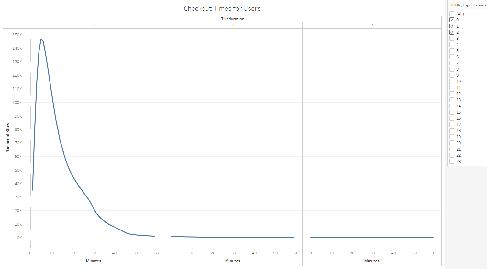
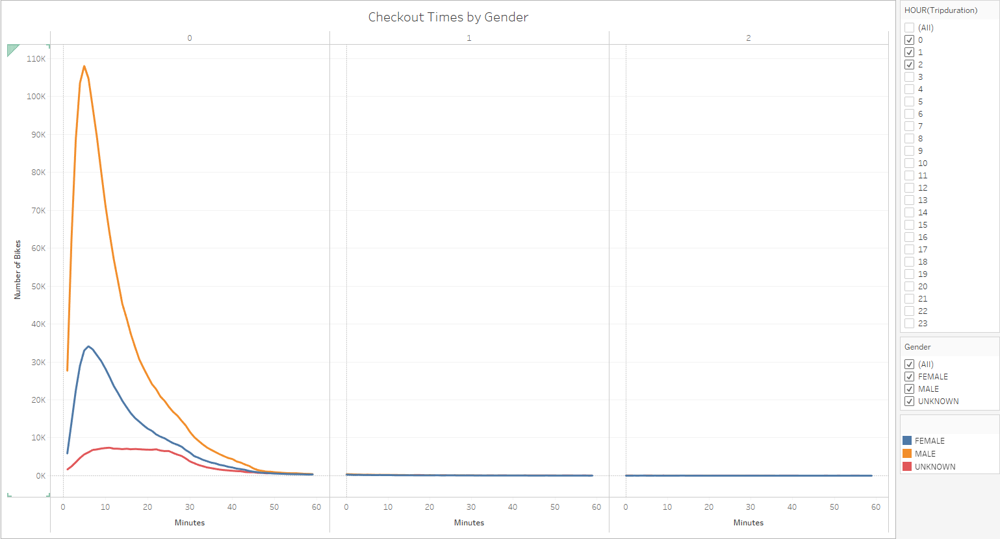
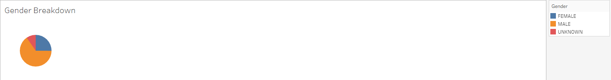
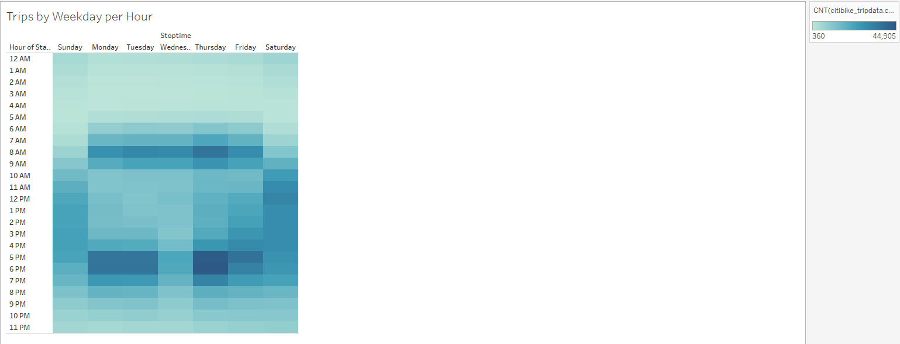
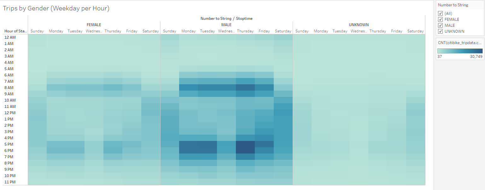
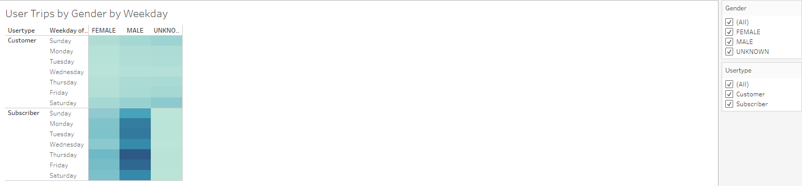
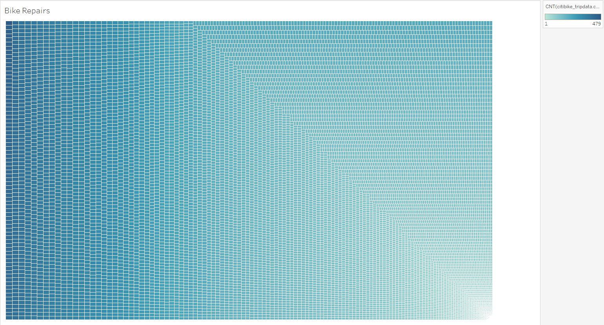

# bikesharing

## Overview

An analysis of bike-sharing information from the Citi Bike program in New York City for the month of August, 2019 using Tableau. Link to the dashboard below:

[link to dashboard](https://public.tableau.com/app/profile/andrew.brewer7081/viz/bikesharing_16718154599180/Presentation)

## Checkout Time Length and Gender Breakdown of Users

Most trips made were of short duration based on checkout times, under an hour, and although more males checked out bikes than females or the unknown category, checkout times remained about the same.

## Popular Checkout Times and Days

The most popular times for trips wask around 8:00 am and 5:00 to 6:00 pm on weekdays, which appears to be about the same across genders. Numbers were more spread out on Saturdays and Sundays especially between 10:00 am to 600 pm. This suggests a high use of the bikes for workday commutes and also weekend recreation.

## Subscriber/Customer Usage

Subscribers appear to mostly be male and most heavily use the bikes on Thursdays and Fridays. The gender of more customers are unknown, but across genders, the customer data show heavier usage on Saturdays and Sundays.

## Bike Repairs

The repair data seems to show a wide variation between bikes that have required repairs (as little as 1) and some that have required a large number (as many as 479). More analysis could be used to see if there are patterns of use between high and low use bikes such as showing the routes for the heaviest and lowest used bikes.
Another analysis that could be made is to see if there is more distinction of trip durations during the week and during the weekends.
